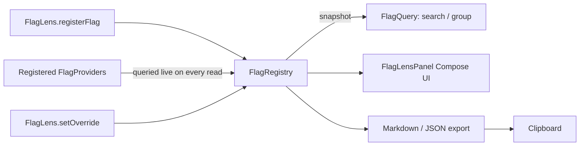

# FlagLens

**"Why is this feature on for me?" — answered in one tap, not one Slack thread.**

[](https://github.com/Sourav19o7/flaglens-android/actions/workflows/build.yml)


FlagLens is an in-app debug panel for inspecting feature flags, experiment assignments, remote
config values, and runtime context (environment, user segment, build variant) — all in one
searchable, groupable view, with optional local overrides for testing.

> **Production readiness disclaimer**: this is a `0.1.0` MVP built for a single evaluation
> exercise. Core logic (registry, masking, search/grouping, serialization) has unit test coverage;
> the Compose UI and the singleton facade are exercised manually via the sample app, not by
> automated instrumentation tests — see Known limitations.

## The problem

"Why is this feature enabled for this user?" is a surprisingly hard question to answer at a
glance once an app has flags from three different systems (a remote config service, a static
build-time map, an internal experiments framework) — each with its own dashboard, none of which
show what the *device in front of you right now* actually resolved to.

## Features

- `FlagProvider` interface for pull-based, always-live flag sources, plus `registerFlag` for
  simple push-based registration — no required backend, no required SDK.
- `setContext` for runtime metadata (environment, user segment, build variant) shown alongside
  flags but modeled separately, since it isn't itself a flag.
- Search and grouping by source in the panel.
- Local overrides, gated behind **two independent** safety flags (see Local overrides below), with
  a session-scoped audit trail of every override set/cleared.
- Sensitive-key masking, on by default, using the same normalized key-matching approach as
  ReproKit's redaction engine (see [`HOW_IT_WORKS.md`](HOW_IT_WORKS.md)).
- Markdown/JSON export and one-tap clipboard copy, for pasting a flag snapshot into a bug report.
- `FlagLensPanel()` Compose component (embed anywhere) or `FlagLens.show(context)` (launches a
  dedicated Activity) — your choice.

## Non-goals

- **Not** a feature-flagging *system* — it has no rollout rules, no targeting, no persistence of
  its own. It's a read/inspect/override layer on top of whatever flag system(s) you already use.
- **No** required Firebase dependency — Firebase Remote Config is supported only as an example
  adapter you copy into your own app (see below), never a dependency of this library.
- **No** background polling, no network calls of its own.

## Architecture overview



See [`HOW_IT_WORKS.md`](HOW_IT_WORKS.md) for the reasoning behind this shape, including why
providers are queried live instead of cached.

## Module structure

```text
flaglens-android/
├── flaglens/    # the library — dev.local.androidtools.flaglens
│   ├── model/       # Flag, FlagValue, ContextEntry, OverrideAuditEntry, FlagReport
│   ├── internal/    # FlagRegistry, Masker, FlagQuery, FlagReportSerializer
│   └── ui/          # FlagLensPanel (Compose), FlagLensActivity
└── sample/      # Compose demo app: sample flags, a live experiment provider, override demo
```

## Supported Android / API levels

`compileSdk`/`targetSdk` 35, `minSdk` 24. The `:flaglens` library itself depends on Jetpack
Compose (Material 3) since `FlagLensPanel` is a Compose component — there is no classic-View
entry point in `0.1.0` (see Known limitations).

## Installation

Not yet published (see [`PUBLISHING.md`](PUBLISHING.md)). Include as a Gradle included build or
copy the `:flaglens` module, same pattern as the other two projects in this family.

## Basic setup

```kotlin
// Application.onCreate()
FlagLens.initialize(
    context = applicationContext,
    config = FlagLensConfig(
        enabled = BuildConfig.DEBUG,
        appName = "My App",
        environment = "staging",
        allowLocalOverrides = BuildConfig.DEBUG, // see "Local overrides" below
    ),
)
```

## Provider architecture

Two ways to get flags into FlagLens:

**Push** — register a value directly, whenever it changes:

```kotlin
FlagLens.registerFlag(
    key = "new_checkout",
    value = true,
    source = "firebase_remote_config",
    metadata = mapOf("experiment" to "checkout_v2", "variant" to "control"),
)
```

**Pull** — register a live source that FlagLens queries fresh every time the panel refreshes:

```kotlin
FlagLens.registerProvider("experiments", object : FlagProvider {
    override fun getAllFlags(): Map<String, FlagValue> = mapOf(
        "checkout_experiment" to FlagValue.of(experimentClient.currentVariant()),
    )
})
```

`FlagProvider` is a `fun interface`, so a lambda works too:

```kotlin
FlagLens.registerProvider("experiments") { mapOf("checkout_experiment" to FlagValue.of("variant_b")) }
```

Use push for one-off/rarely-changing values; use pull for anything backed by a live SDK whose
state can change out from under you (remote config, an experiments client) — pull guarantees the
panel always shows the SDK's current truth, never a stale copy.

## Registering runtime context

```kotlin
FlagLens.setContext(key = "user_segment", value = "trial_user")
FlagLens.setContext(key = "api_environment", value = "staging")
```

Context is modeled and displayed separately from flags — it answers "what environment/user am I
looking at," not "what's on or off."

## Opening the panel

```kotlin
FlagLens.show(context) // launches FlagLensActivity
```

## Compose usage

```kotlin
@Composable
fun DebugMenu() {
    var showPanel by remember { mutableStateOf(false) }
    if (showPanel) {
        FlagLensPanel(onClose = { showPanel = false })
    } else {
        Button(onClick = { showPanel = true }) { Text("Open FlagLens") }
    }
}
```

`FlagLensPanel()` is the same component `FlagLensActivity` hosts — embed it directly in your own
navigation instead of launching a separate Activity if you prefer.

## View-system usage

Not implemented in `0.1.0` — the panel is Compose-only. `FlagLens.show(context)` still works from
a View-based app (it just launches a Compose-hosted `Activity`), but there is no
`FlagLensView`/fragment for embedding inline in a View hierarchy yet. Tracked in Roadmap.

## Firebase adapter explanation

FlagLens never depends on Firebase — adding it as a required dependency would violate this
project's "no required Firebase dependency" rule and would force every consumer to pull in the
Firebase BOM whether they use Remote Config or not. Instead, here is the adapter shape to copy
into *your own app* (which already depends on Firebase, if you use it):

```kotlin
class FirebaseRemoteConfigFlagProvider(
    private val remoteConfig: com.google.firebase.remoteconfig.FirebaseRemoteConfig,
) : FlagProvider {
    override fun getAllFlags(): Map<String, FlagValue> =
        remoteConfig.all.mapValues { (_, value) -> FlagValue.of(value.asString()) }
}

// FlagLens.registerProvider("firebase_remote_config", FirebaseRemoteConfigFlagProvider(Firebase.remoteConfig))
```

This is illustrative, not compiled/tested code in this repo (the repo has zero Firebase
dependencies by design) — adjust `value.asString()`/type handling for your actual flag types.

## Local overrides

Overrides let you force a flag's *effective* value locally without touching the real source —
useful for testing a specific variant without waiting for a remote config change to propagate.

They're gated behind **two independent** config flags:

```kotlin
FlagLensConfig(
    enabled = BuildConfig.DEBUG,        // must be true
    allowLocalOverrides = BuildConfig.DEBUG, // must ALSO be true
    // ...
)
```

`FlagLens.setOverride(key, value)` checks `enabled` first, regardless of `allowLocalOverrides` —
so a release build with the standard `enabled = BuildConfig.DEBUG` wiring can never reach an
override write, full stop. This is what "impossible to accidentally enable local overrides in
release builds unless the developer explicitly bypasses the safety check" means concretely: you'd
have to explicitly hardcode both flags to `true` to make overrides reachable in a release build —
there's no single toggle that does it by accident.

The panel always shows the **actual** value and the **override** value distinctly
(`Flag.actualValue` vs. `Flag.overrideValue`, rendered as `real → override` when both are set) —
never conflated into one number, so you can't mistake an override for what the flag "really" is.

```kotlin
FlagLens.setOverride("new_checkout", "false") // returns false if overrides aren't allowed
FlagLens.clearOverride("new_checkout")
FlagLens.clearAllOverrides()
FlagLens.auditTrail() // every SET/CLEAR/CLEAR_ALL this session, for "wait, did I override this?"
```

## Security and privacy

Masking is on by default (`maskingEnabled = true`). Any flag or context key that, after stripping
punctuation and lowercasing, contains `token`, `access_token`, `refresh_token`, `authorization`,
`cookie`, `password`, `passwd`, `secret`, `api_key`, or `apikey` is displayed as `[MASKED]` in the
panel and in exports — not just the panel. `additionalSensitiveKeys` in `FlagLensConfig` extends
this list per app. See [`SECURITY.md`](SECURITY.md) for the full threat model, including why
masking is a safety net, not a substitute for not registering secrets as flags in the first place.

## Release-build protection

Same pattern as ReproKit/OfflineLab: `FlagLensConfig.enabled` must be wired to your own debug
flag. When `enabled` is `false`, `registerFlag`/`registerProvider`/`setContext`/`show` all become
no-ops, and `setOverride` always returns `false`. FlagLens cannot detect your build type on its
own — this wiring is the host app's responsibility.

## Exporting reports

```kotlin
val markdown = FlagLens.exportMarkdown()
val json = FlagLens.exportJson()
FlagLens.copyToClipboard(context, markdown)
```

Both formats respect masking — a masked flag is `[MASKED]` in the export too, not just on screen.

## QA workflows

- **"Why is this feature on for me?"** — open the panel, search the flag key, read its `source`
  and `metadata` (e.g. `experiment=checkout_v2, variant=control`).
- **"What did remote config actually return, right now, on this device?"** — pull-based providers
  are queried live, so the panel reflects the SDK's current state, not a cached guess.
- **"Force variant B without waiting for a config change to roll out"** — set a local override
  (debug builds only), test, then clear it.
- **"Attach my current flag state to a bug report"** — Copy Markdown, paste into the issue.

## Testing instructions

```bash
./gradlew :flaglens:testDebugUnitTest
./gradlew :flaglens:lintDebug
./gradlew :flaglens:assembleDebug :sample:assembleDebug
```

## Roadmap

- `maven-publish` wiring (see `PUBLISHING.md`).
- Shake-gesture and hidden-tap-sequence panel activation (disabled/unimplemented in `0.1.0` — see
  Known limitations).
- A classic-View entry point (`FlagLensView`/fragment) for non-Compose apps.
- Instrumentation tests for the Compose panel (search, grouping, override, reset, copy).

## Known limitations

- No shake-gesture or tap-sequence activation implemented yet — only `FlagLens.show()` /
  `FlagLensPanel()` (explicit/programmatic).
- Compose-only; no View-system panel.
- The `FlagLens` singleton facade itself has no automated tests (it requires an Android `Context`
  to initialize) — its internals are fully unit tested and the facade is exercised via the sample
  app. Same disclosed gap as ReproKit's Android-boundary classes.
- Masking is key-name based, same caveat as ReproKit's redactor: a secret value stored under a
  non-obviously-named key won't be caught.

## Contributing

See [`CONTRIBUTING.md`](CONTRIBUTING.md).

## License

[Apache License 2.0](LICENSE).

## FAQ

**Does this require Firebase?** No — see Non-goals and the Firebase adapter section.

**Can two providers register the same flag key?** Yes, deliberately — they show as separate rows
grouped by their different `source`, which is often exactly what you want when comparing what two
systems think a flag's value is.

**Do overrides persist across app restarts?** No — everything is in-memory only, cleared on
process death, matching this whole project family's "local-only, debug-time" model.

**What happens to a masked flag's override?** The override value you typed is still shown (you
typed it yourself, it isn't collected data) — only the *actual* underlying value stays masked.

**Why is `FlagLensPanel()` in the library itself instead of only in the sample app?** So any host
app can embed it directly in their own debug menu/navigation without copying UI code — the sample
app demonstrates both that embedded usage and the `FlagLens.show()` Activity-launch shortcut.
